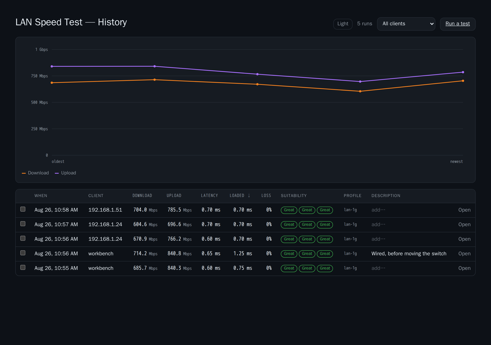
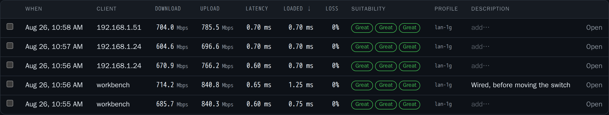
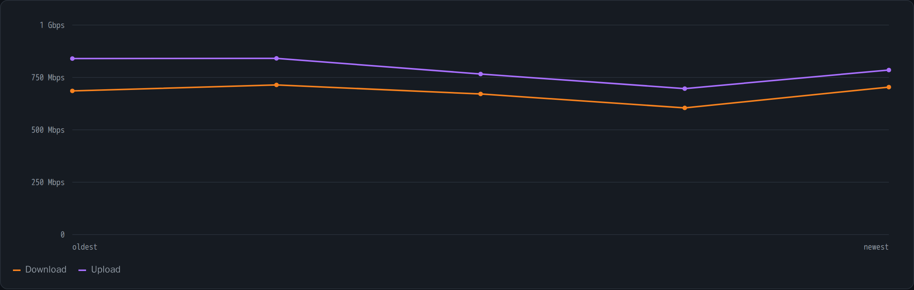
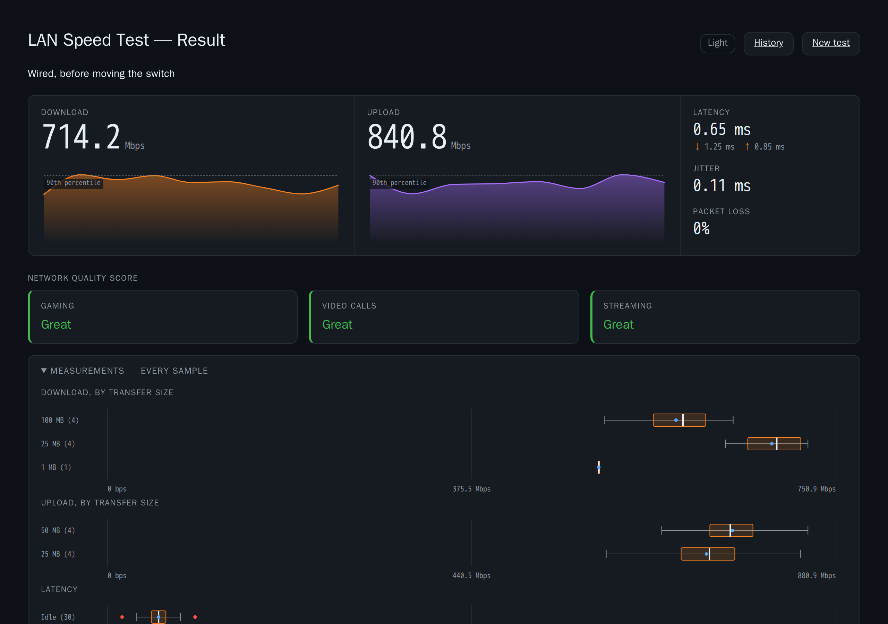
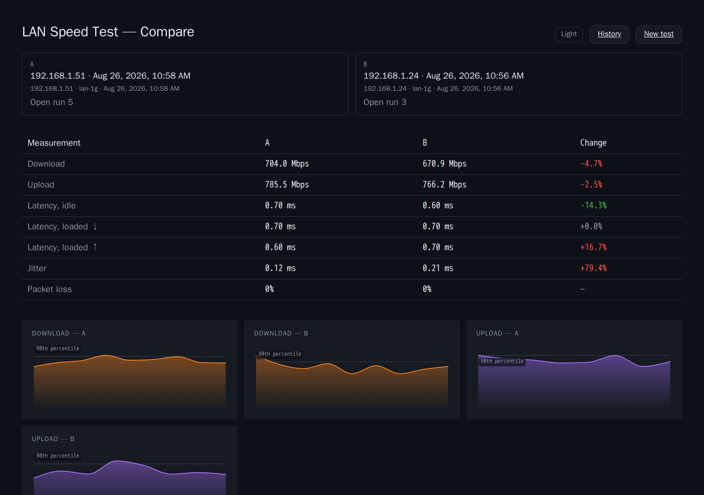

# History and metrics

A single run tells you what the link is doing now. The interesting question is
almost always what changed — which needs the run kept, and compared.

History is on whenever `server.history_db` names a file, which it does by
default. Setting it empty disables the feature: the link disappears from the
page and the endpoints degrade quietly rather than erroring.

## The history page



Two halves. The chart draws download and upload across the runs currently in
view, oldest to newest; the table is the runs themselves.



| Column | Notes |
|---|---|
| When | Local time of the run |
| Client | The name if one is set, otherwise the address — see [Client Identity](Client-Identity.md) |
| Download / Upload | The same 90th-percentile figures the run reported |
| Latency / Loaded | Idle and loaded round trip |
| Loss | `0%` and `—` mean different things: see below |
| Suitability | The three ratings, or a dash where the run produced none |
| Profile | Which profile measured it, so mixed-profile history stays honest |
| Description | Free text, click to edit |

**A dash is not a zero.** A run with no packet-loss stage — no relay
configured — shows `—`, and a run that measured no loss shows `0%`. Collapsing
those two into one number would make "we never checked" indistinguishable from
"we checked and it was fine", which is exactly the distinction you need when a
call is breaking up.

The **client filter** narrows both the table and the chart to one client. A
trend across three different machines is not a trend; it is three trends
overlaid.



## Describing a run

Any stored run can carry a short description — where you were, on what device,
what you were trying to prove. Click the Description cell in the history table,
or the same field on the run's own page, and type.

This is deliberately per-run rather than per-client. A client name says *which
machine*; a description says *which test*, and that is what differs between two
runs from the same laptop an hour and a floor apart. Without one, a history of
twenty runs from one machine is twenty numbers with no way to tell which was
the one taken in the garage.

## Permalinks

Every stored run keeps its samples, not just its headline, so
`/result.html?id=N` **redraws** the run rather than summarising it — the same
traces, the same distributions, the same ratings:



History rows link to it, and a finished run offers a link to itself.

Sample blobs are size-capped. A run whose samples exceed the cap is stored
without them: the measurement succeeded, and losing it over the size of its
detail would not be an improvement. Such a run still draws its headline
afterwards, exactly as every run stored before 1.3.0 already does.

## Comparing two runs

Tick two rows in the history and press Compare.



`/compare.html` puts them side by side and computes the difference, because the
interesting part of two runs is the change between them and the eye is poor at
differencing two columns of formatted numbers.

The change is signed by **improvement**, not by arithmetic. More bandwidth and
less latency are both good news, so both are green; a table that coloured by
the sign alone would say the opposite on half its rows. A change under 2% is
reported as no change — two runs of the same link differ by that much every
time, and a page that called it an improvement would cry wolf on every use.

A dash means the comparison has no answer: one of the runs did not measure that
thing, or the earlier value was zero. A percentage of nothing is undefined
rather than infinite — which is why two runs that both measured 0% packet loss
show a dash rather than "0%".

### When latency cannot be compared

If either run predates 1.3.1, its latency carries up to 40 ms of the
`TCP_NODELAY` stall that release fixed. Those rows are greyed and marked, and
the footer says so: the difference is mostly our own bug being fixed, not the
network changing. Bandwidth is unaffected — the bug only ever delayed small
responses, which is why it survived three releases with throughput looking
right.

This works because every run records the build that measured it. Without that,
a corrected release makes the whole history silently incomparable.

## Retention

Both windows are **off by default** (`0` = keep forever). Quietly deleting a
homelab's measurement history because a default said so is not a behaviour
anyone should have to discover and opt out of.

| Setting | Effect |
|---|---|
| `retain_runs_days` | Delete runs older than this |
| `retain_samples_days` | Drop the per-sample blob, keep the run |

Two windows because the costs differ by orders of magnitude. A summary row is a
couple of hundred bytes and is what a trend is made of; the sample blob behind
it can be a quarter of a megabyte and stops being interesting long before the
run does. Releasing samples while keeping runs is usually what you want.

Pruning happens at startup and once a day thereafter, with the cutoff
recomputed each pass so a long-running service does not freeze its window at
whatever it was when it booted.

## Prometheus metrics

`server.metrics` (or `SPEEDTEST_METRICS`) serves `/metrics` in Prometheus text
format. **Off by default**: the body names every client that has ever run a
test, which is more than an unauthenticated endpoint should hand out unless
someone has asked for it. There is no authentication on it — put it behind
whatever your reverse proxy or firewall already does, or leave it off.

When it is off the route still exists and returns **404 from the handler**. An
unmounted route would fall through to the single-page-app fallback and answer a
scrape with `200 text/html` and the app shell, which a monitoring system reads
as a permanently healthy target with no series in it.

What it exports is the **most recent run per client**, not the history. A
scrape is a question about now; the history is already a database, and
re-exporting all of it every fifteen seconds is the wrong shape for both.

```
speedtest_build_info{version,git_sha}                    1
speedtest_history_runs_total                             gauge, not a counter —
                                                         pruning makes it fall
speedtest_download_bits_per_second{client,name,profile}
speedtest_upload_bits_per_second{client,name,profile}
speedtest_latency_seconds{client,name,profile}
speedtest_loaded_latency_download_seconds{...}
speedtest_loaded_latency_upload_seconds{...}
speedtest_jitter_seconds{client,name,profile}
speedtest_packet_loss_ratio{client,name,profile}
speedtest_run_timestamp_seconds{client,name,profile}
```

Three things worth knowing before building a dashboard on it:

- **Base units**, per Prometheus convention: seconds rather than milliseconds,
  a ratio rather than a percentage. Scale for display; a unit that was thrown
  away cannot be recovered.
- **A figure that was never measured is absent, not zero.** No packet-loss
  stage and 0% packet loss are different claims, and a graph cannot tell them
  apart once both are `0`. Use `absent()` if you want to alert on the
  difference.
- **The address is always the `client` label and never changes.** A friendly
  name rides alongside in `name` rather than replacing it, so renaming a client
  does not silently become a new time series and break every dashboard built on
  it.

---

See also: [Reading the Results](Reading-the-Results.md) ·
[Client Identity](Client-Identity.md) ·
[Configuration](Configuration.md) ·
[HTTP API](HTTP-API.md)
