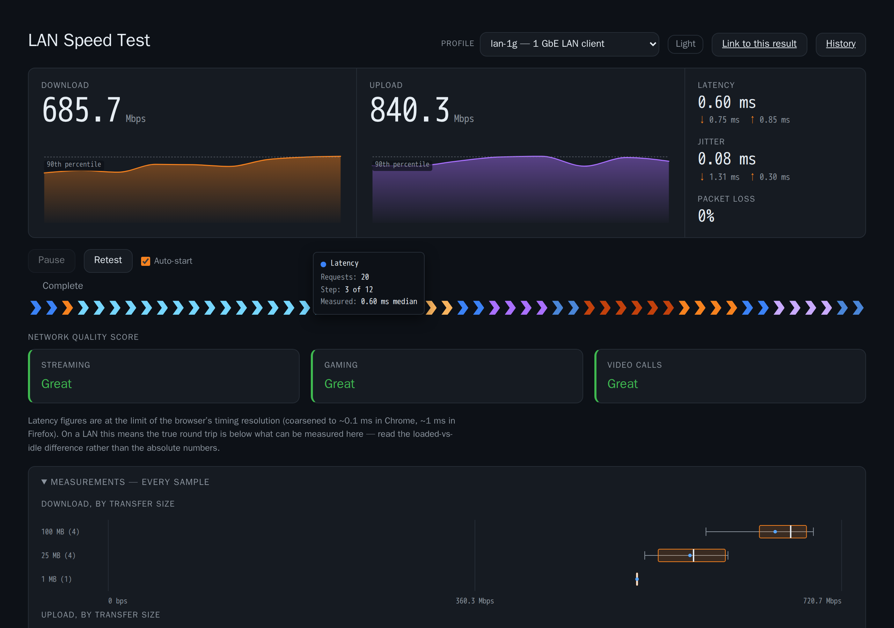

# lan-speedtest

A LAN speed test that behaves like speed.cloudflare.com — download, upload,
idle and loaded latency, jitter, packet loss and quality ratings — but runs
entirely inside your own network and never contacts Cloudflare's edge.

Cloudflare open-sourced the measurement engine as
[`@cloudflare/speedtest`](https://github.com/cloudflare/speedtest); the site at
speed.cloudflare.com is not open source. This project supplies the rest: a
backend that satisfies the engine's endpoint contract, a front end that drives
it, a coturn relay for the packet-loss stage, and the container that serves it
all.

*A finished run: bandwidth in both directions with the reported percentile
marked, latency idle and under load, jitter, packet loss, and the engine's own
suitability ratings.*

> **This wiki is public-safe.** No real addresses, hostnames or credentials
> appear anywhere in it. Placeholders are used throughout — substitute your own.

> Not affiliated with, sponsored by, or endorsed by Cloudflare, Inc. Cloudflare
> is a trademark of Cloudflare, Inc. This project is *built on* their
> open-source `@cloudflare/speedtest` engine, used under the MIT licence.

## Pages

### Getting it running

| Page | What it covers |
|---|---|
| [Quick Start](Quick-Start.md) | From nothing to a measured link, with `docker compose` |
| [Deployment](Deployment.md) | Running it properly on a host: TLS, the relay, firewall, updates |
| [Configuration](Configuration.md) | `config/speedtest.toml`, measurement profiles, environment variables |
| [TURN and Packet Loss](TURN-and-Packet-Loss.md) | coturn setup, credentials, verifying a relay candidate |

### Using it

| Page | What it covers |
|---|---|
| [Reading the Results](Reading-the-Results.md) | What each figure means, the distribution view, and why raw throughput is a separate number |
| [History and Metrics](History-and-Metrics.md) | Stored runs, trends, comparing two runs, retention, the Prometheus endpoint |
| [Client Identity](Client-Identity.md) | Who a run belongs to: reverse DNS, friendly names, trusted proxies, and the addresses that cannot be recovered at all |
| [Troubleshooting](Troubleshooting.md) | Symptoms and their causes, especially the silent ones |

### Working on it

| Page | What it covers |
|---|---|
| [Engine Contract](Engine-Contract.md) | **Start here before touching the backend.** The `@cloudflare/speedtest` request/response contract as verified from source, the config keys that keep traffic local, and the two engine behaviours that shape the whole design |
| [Architecture](Architecture.md) | How the pieces fit: request flow, what runs where, why each choice |
| [HTTP API](HTTP-API.md) | Every route the backend serves, and what it answers with |
| [Development](Development.md) | Local setup, build, run, regenerating these screenshots |
| [Testing](Testing.md) | The tiers, what each gates, how to run them |
| [Release History](Release-History.md) | What shipped in each version |

## The short version

- **Backend** — Rust/Axum. Serves `/__down` and `/__up` plus the built front
  end. Download payloads are refcounted slices of one pre-allocated buffer, so
  there is no per-request allocation in the data path.
- **Front end** — TypeScript/Vite, no framework. Drives the engine, renders
  live results and quality ratings, dark by default.
- **coturn** — on the same host, for the packet-loss stage. The engine measures
  loss by relaying a UDP burst from the browser back to itself.
- **Config** — one TOML file with named measurement profiles. The engine's own
  defaults are tuned for internet paths and are actively wrong on a LAN; see
  [Configuration](Configuration.md).

## Three things that will bite you

1. **`logAimApiUrl` defaults to a Cloudflare endpoint** and the engine POSTs
   every completed result to it. It must be `null`. Pinned server-side,
   re-checked client-side, and asserted by tests at two tiers.
2. **`server-timing` must be spelled `cfRequestDuration;dur=N`.** Any other
   spelling — including the obvious `dur=N` — is silently ignored, and latency
   quietly falls back to a fixed estimate.
3. **`loadedRequestMinDuration` defaults to 250 ms**, above the duration of
   almost any LAN transfer. Leave it alone and loaded latency is never
   measured, which in turn removes *every* quality rating with no error shown.

---

New here? [Quick Start](Quick-Start.md). Changing the backend?
[Engine Contract](Engine-Contract.md) first.
