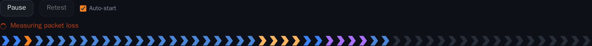
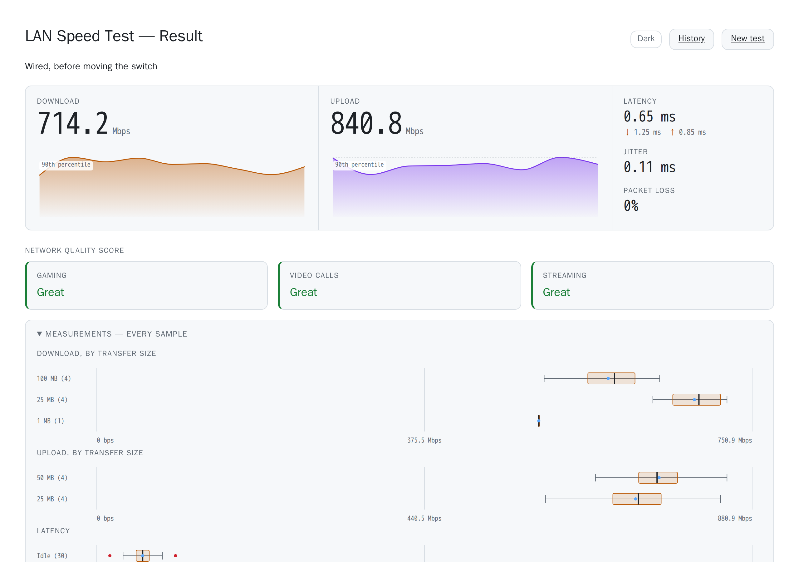

# Quick start

From nothing to a measured link. Everything here runs on one host and stays on
your network.

## What you need

- A Linux host on the LAN with Docker and the compose plugin.
- Nothing else. There is no account, no API key, and no external service to
  register with.

The container image is public, so no `docker login` is needed to pull it.

## Run it

```sh
git clone https://github.com/sremich/lan-speedtest.git
cd lan-speedtest
cp .env.example .env          # fill in; never commit it
docker compose up -d
```

**Comment out the three `SPEEDTEST_TLS_*` lines in `.env` for a first run.**
They point at a certificate you do not have yet, and the service refuses to
start rather than falling back to plain HTTP — deliberately, because a silent
downgrade to unencrypted is a worse outcome than a refusal. Plain HTTP on 8080
is the right way to try it; [Deployment](Deployment.md) covers adding TLS.

Then open the host in a browser — `http://HOST:8080/` unless you have set up
TLS. **The test starts as soon as the page loads**, so the first thing you see
is a run already in progress:



*One chevron per request the profile will issue, coloured by stage: blue for
latency, orange for download, purple for upload, red for packet loss. The line
above names the stage running right now.*

When it finishes you have the full picture — see
[Reading the Results](Reading-the-Results.md) for what each figure means.

## The one setting to get right

`SPEEDTEST_PROFILE` picks how much data to move and how to interpret it. The
shipped profiles are `lan-1g`, `lan-2.5g`, `lan-10g` and `quick`:

```sh
# in .env
SPEEDTEST_PROFILE=lan-1g
```

Getting this wrong does not produce an error — it produces a plausible wrong
answer. A profile sized for a slower link finishes its transfers too fast to
count as loading the connection, and the quality ratings then disappear with
nothing said. [Configuration](Configuration.md) explains the sizing rules.

If you would rather not choose, the picker in the page offers **Auto**, which
measures the link with one short transfer and then selects a profile to match.

## Then, in rough order of value

| Next | Why |
|---|---|
| [Deployment](Deployment.md) | TLS, the firewall, and pinning an image tag — what a permanent install needs |
| [TURN and Packet Loss](TURN-and-Packet-Loss.md) | Without a relay there is no packet-loss figure, and the quality ratings shift |
| [Configuration](Configuration.md) | Naming the deployment, retention, reverse DNS, metrics |
| [Reading the Results](Reading-the-Results.md) | Especially the loaded-minus-idle latency difference |

## Light and dark

The page follows the browser's own light/dark preference and has a toggle
beside the profile picker. The choice is remembered per browser.



*A stored run in the light theme. Every page carries the same toggle.*

## Turning off auto-start

A run moves hundreds of megabytes, which is the last thing you want during the
video call that made you suspicious of the network in the first place. It can
be turned off three ways, most specific first — see
[Configuration](Configuration.md#auto-start).

---

See also: [Deployment](Deployment.md) ·
[Configuration](Configuration.md) ·
[Reading the Results](Reading-the-Results.md) ·
[Troubleshooting](Troubleshooting.md)
